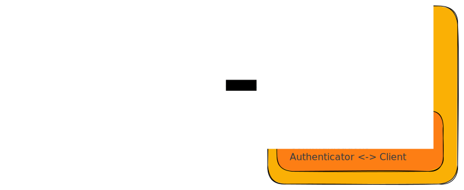
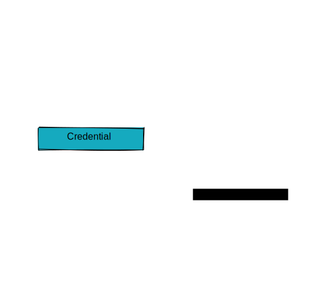

# Passkeys <!-- omit from toc -->

## TOC <!-- omit from toc -->

- [1. Glossary](#1-glossary)
- [2. FIDO](#2-fido)
- [3. WebAuthn](#3-webauthn)
- [4. UCAN and WNFS](#4-ucan-and-wnfs)
- [5. Support](#5-support)
  - [5.1. PRF Support](#51-prf-support)
    - [5.1.1. Chromium](#511-chromium)
  - [5.2. LargeBlob Support](#52-largeblob-support)
    - [5.2.1. Chromium](#521-chromium)
    - [5.2.2. Safari](#522-safari)
- [6. Notes](#6-notes)
- [7. Open Questions](#7-open-questions)
- [8. References](#8-references)

## 1. Glossary

- `navigator.credentials` is a global object that provides access to the [Credential Management API](https://w3c.github.io/webappsec-credential-management). It allows web applications to access browser stored credentials, such as usernames and passwords, to authenticate users.
- [`PublicKeyCredential`](https://w3c.github.io/webauthn/#iface-pkcredential) extends `Credential` and represents a public key credential, which is a credential that contains a public key and can be used to prove possession of the corresponding private key. It is used to authenticate users.
- [Authenticator](https://w3c.github.io/webauthn/#authenticator) its a cryptographic entity like a yubikey or a fingerprint reader that can be used to generate and store credentials.
- [Relying Party](https://w3c.github.io/webauthn/#relying-party) (RP) is the entity that is relying on the user's identity. Normaly, it's the web application and it has 2 components the client and the server. In our case, the server component is TBD.
- [Server-side Credential] is a credential that is stored on the server and not on the authenticator. It's used to authenticate users without the need of an authenticator.
- [Discoverable Credential] is a credential that is stored on the authenticator and can be used to authenticate users without the need of a server.
- [FIDO2] consists of two standardized components, a web API (WebAuthn) and a version 2 of CTAP. WebAuthn is a JavaScript API for accessing public key credentials, while CTAP is a protocol for communicating with authenticators.
- FIDO Cross-Device Authentication (CDA) flow allows a passkey to be used to sign in on another device (ex: passkey on Android signing into a service on Windows).

## 2. FIDO

## 3. WebAuthn

## 4. UCAN and WNFS

For signatures we have the following options:

1. Use the authenticator signatures requires custom signature valitation and UCAN needs to include client and authenticator data in the payload.
2. PRF extension, use one of the output secret as the private key for a ed25519 keypair
3. largeBlob extension, store the secret in the largeBlob and use it to generate a ed25519 keypair

For encryption we have the following options:

1. PRF extension, use one of the secrets as key material to derive an encryption key.
2. LargeBlob extension, to store a secret in the largeBlob and use it to derive an encryption key.

## 5. Support

| Feature                     | Android                  | iOS    | MacOS                                                  | Windows         |
| --------------------------- | ------------------------ | ------ | ------------------------------------------------------ | --------------- |
| Passkey                     | 9+ ✅                    | 16+ ✅ | 13+ ✅                                                 | 10+ ✅          |
| Cross-Device Authentication | ✅                       | ✅     | ❌                                                     | ❌ 2 |
| Cloud Sync                  | ✅                       | ✅     | Safari ✅   Chromium 1 🚧              | ❌              |
| PRF Extension               | Chromium 3 ✅ | ❌     | Chromium 3,4 🚧                             | ❔              |
| largeBlob Extension         | ❌                       | ❔     | Chromium 5 ❌   Safari 6 ❌ | ❔              |

1 Planned using iCloud.

2 Not support on the OS level on directly on Chromium.

3 Behind chrome://flags/#enable-experimental-web-platform-features, doesn't work with CDA.

4 Platform authenticator on mac doesnt support it but yubikey does.

5 Shipped in 113, API seems to be there but always return supported `false` for all authenticators.

6 Shipped in 166 Tech Preview, but API doesn't seem to be there.

### 5.1. PRF Support

#### 5.1.1. Chromium

Intent to Ship: https://groups.google.com/a/chromium.org/g/blink-dev/c/iTNOgLwD2bI/m/1zKXsF7uAgAJ
Tracking bug: https://bugs.chromium.org/p/chromium/issues/detail?id=1106961

### 5.2. LargeBlob Support

#### 5.2.1. Chromium

- https://chromestatus.com/feature/5657899357437952
- Tracking bug: https://bugs.chromium.org/p/chromium/issues/detail?id=1114875
- Intent to Ship: https://groups.google.com/a/chromium.org/g/blink-dev/c/guUJ9FuOIfc/m/30durTKDBgAJ

#### 5.2.2. Safari

- https://bugs.webkit.org/show_bug.cgi?id=252789
- https://github.com/WebKit/WebKit/pull/9891
- https://webkit.org/blog/13964/release-notes-for-safari-technology-preview-166/

## 6. Notes

- Chrome Devtools console has a WebAuthn tab that can be used to test the API
- We should always force [Discoverable Credential] on registration this means `requireResidentKey: true, residentKey: 'required'`. Safari seems to force it anyway.
- Authenticators may not support evaluating [prf] during registration. In this case a secondary [assertion] is needed.
- FIDO Cross-Device Authentication flow requires [CTAP2.2]

## 7. Open Questions

- Should we store credentials! Where browser(probably not), server, dns records, did document ?
  - how much do we validate the credential ? If we store it in the public and do validation in the client whats the threat model ?
- [prf] vs [largeBlob] which one should we use ? Maybe both to support wallet migration and store the seed in the [largeBlob] storage?
- CTAP 2.1 and 2.2 on Android Play Services how can we track this ?
- `residentKey` seems to force chrome android to only use the native authenticator. An hardware authenticator (yubikey) isnt a [Discoverable Credential] ?? it should be according to the spec definition.
- Research [Attestation] and check how useful it is to us.

## 8. References

- <https://webauthn.guide/>
- <https://webauthn.io/>
- <https://passkeys.dev/>
- <https://www.passkeys.io/>
- <https://github.com/MasterKale/SimpleWebAuthn>
- <https://web.dev/passkey-registration/>
- <https://web.dev/passkey-form-autofill/>
- <https://developers.google.com/identity/passkeys>
- <https://developers.yubico.com/Passkeys/>
- <https://www.hanko.io/blog/passkeys-part-1>
- <https://github.com/herrjemand/awesome-webauthn>
- <https://developer.android.com/training/sign-in/passkeys>
- <https://securitykeys.info/ts/test_suite.html>
- <https://blog.millerti.me/2023/01/22/encrypting-data-in-the-browser-using-webauthn/>
- <https://levischuck.com/blog/2023-02-prf-webauthn>

[Server-side Credential]: https://w3c.github.io/webauthn/#server-side-credential
[Discoverable Credential]: https://w3c.github.io/webauthn/#discoverable-credentials
[Attestation]: https://w3c.github.io/webauthn/#attestation
[prf]: https://w3c.github.io/webauthn/#prf-extension
[largeBlob]: https://w3c.github.io/webauthn/#sctn-large-blob-extension
[assertion]: https://w3c.github.io/webauthn/#assertion
[FIDO2]: https://fidoalliance.org/fido2/
[CTAP2.1]: https://fidoalliance.org/specs/fido-v2.1-ps-20210615/fido-client-to-authenticator-protocol-v2.1-ps-errata-20220621.html
[CTAP2.2]: https://fidoalliance.org/specs/fido-v2.2-rd-20230321/fido-client-to-authenticator-protocol-v2.2-rd-20230321.html
[hmac-secret]: https://fidoalliance.org/specs/fido-v2.1-ps-20210615/fido-client-to-authenticator-protocol-v2.1-ps-errata-20220621.html#sctn-hmac-secret-extension
